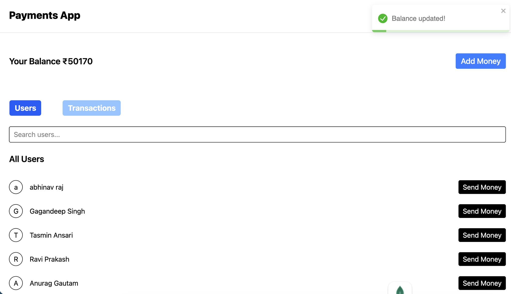
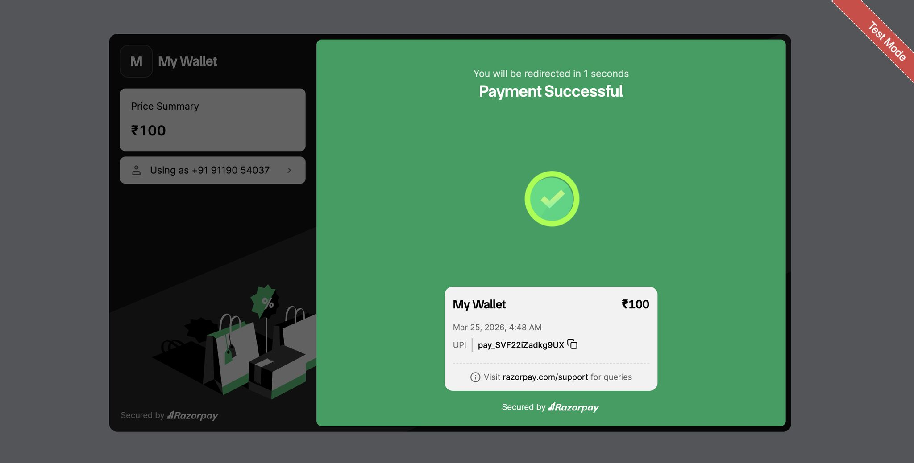
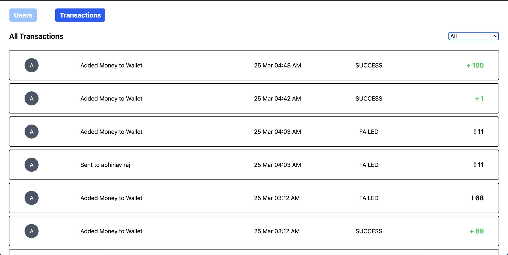

# Pay-App

A full-stack, highly robust payment web application. It allows users to manage a digital wallet, add funds securely, and instantly transfer money to other users.

## 🌟 Advanced Technical Highlights

This application is built with system resilience and data integrity in mind. Here is how the heavy-lifting works under the hood:

### 1. Robust Payment Processing (Razorpay Integration)
We use Razorpay to handle complex "Add Money" operations. Standard order creation occurs server-side to prevent tampering, while the client securely interacts with the Razorpay SDK. Signature verification occurs strictly in the backend, ensuring malicious clients cannot fake payment successes.

### 2. Dual-Layer Payment Safety (Webhooks + Reconciliation)
Network failures happen. To ensure no user ever loses money if they close their browser during a payment, the app implements a **dual-layer safety mechanism**:
- **Real-Time Webhooks:** Razorpay hits our secure `/payment/webhook` endpoint instantly upon a successful or failed payment to update the ledger. Signature verification is enforced.
- **Background Reconciliation (Cron Job):** As a fallback (in case the webhook fails or drops), a background reconciliation cron job continuously polls Razorpay's APIs to identify and recover "Pending" or "Stuck" transactions that are older than a few minutes.

### 3. ACID Compliance & Atomicity
- **Double-Credit Protection:** Database queries use atomic `$set` operations alongside a `credited: false` flag. This guarantees that between the Webhook and the Cron Job racing to update a payment status, the user is **never credited twice**.
- **Atomic Money Transfers:** When sending money from User A to User B, we utilize **MongoDB Sessions and Transactions**. This ensures that deducting balance and adding balance execute as one single, unbreakable unit. If an error occurs midway, the entire transaction rolls back cleanly.

### 4. Optimized Data Fetching (Pagination)
To ensure the app scales securely and remains fast as the user base grows, the backend implements **pagination** using MongoDB `skip` and `limit` operations. 
- The `/bulk` endpoint for searching users ensures the client doesn't load the whole database at once.
- The **Transactions History** fetches a maximum of 5 records per query, saving bandwidth and offering a smooth "Load More" capability on the frontend.

---

## 📸 App Screenshots

| Dashboard & Sending Money | Razorpay Top-Up | Transaction History |
|:---:|:---:|:---:|
|  |  |  |

---

## 🚀 App Functionalities

- **User Authentication:** Secure Signup and Signin using JWT and bcrypt.
- **Profile Management:** Update your firstname, lastname, email, or password.
- **Search Users:** Search and find other users in the app to send money to.
- **Wallet Dashboard:** Check your current wallet balance at any time.
- **Add Money:** Top-up your wallet using the Razorpay payment gateway.
- **Send Money:** Instantly transfer funds from your wallet to another user's wallet.
- **Transaction History:** View a paginated list of your past transactions (both sent and received).

---

## 🛠️ Tech Stack

- **Frontend:** React, Vite, Tailwind CSS
- **Backend:** Node.js, Express.js
- **Database:** MongoDB
- **Security & Payments:** JWT, bcrypt, Razorpay API, HMAC SHA256 Signature Verification

---

## ⚙️ Quick Start

### 1. Backend Setup

1. Open a terminal and navigate to the backend folder: `cd backend`
2. Install dependencies: `npm install`
3. Create a `.env` file in the `backend` folder with:
   ```env
   PORT=3000
   MONGODB_URI=your_mongodb_uri
   JWT_SECRET=your_jwt_secret
   RAZORPAY_KEY_ID=your_razorpay_key_id
   RAZORPAY_KEY_SECRET=your_razorpay_key_secret
   ```
4. Start the server: `node index.js`

### 2. Frontend Setup

1. Open a terminal and navigate to the frontend folder: `cd frontend`
2. Install dependencies: `npm install`
3. Start the app: `npm run dev`
